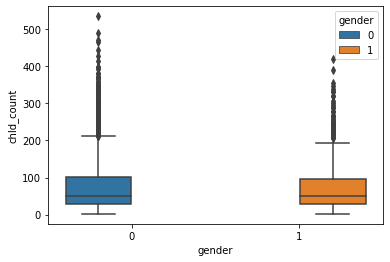
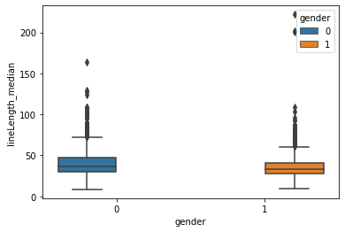
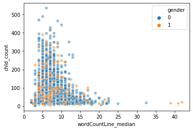
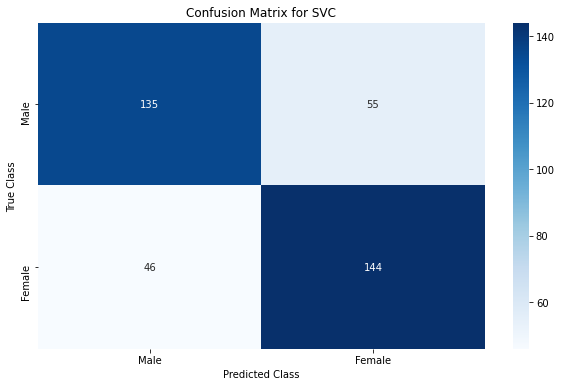
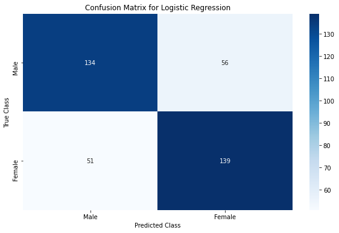
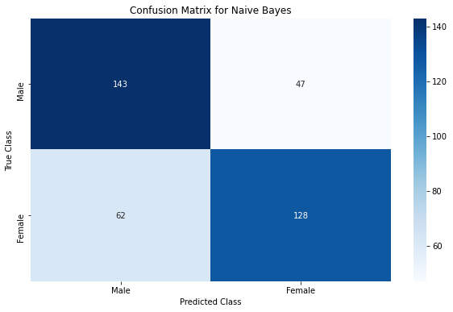
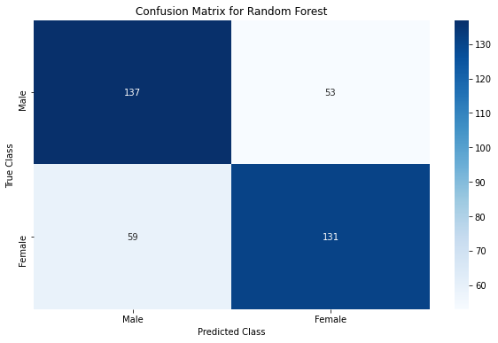
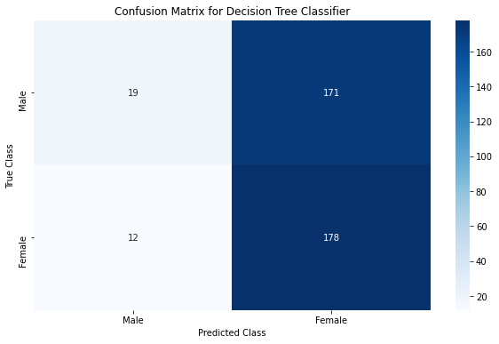
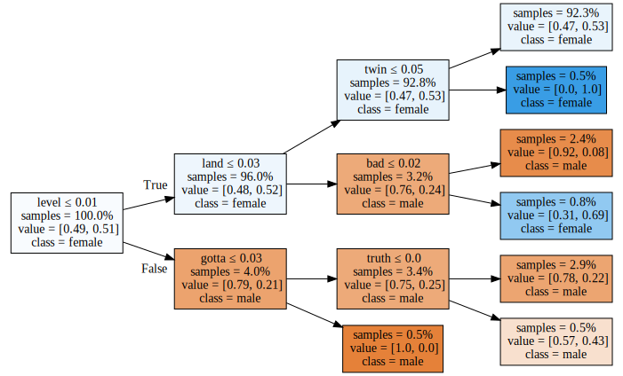

In this notebook, we will try to predict the gender of a Hollywood movie character based in his / her dialogues in the movie. The [dataset](https://www.kaggle.com/Cornell-University/movie-dialog-corpus) was released by [Cornell University](http://www.cs.cornell.edu/~cristian/Cornell_Movie-Dialogs_Corpus.html). This classifier will help us understand if there is some kind of gender bias between male and female characters in Hollywood movies.

### Import necessary libraries


```python
import pandas as pd
import numpy as np
import re
from nltk.corpus import stopwords
from nltk.stem import WordNetLemmatizer
from wordcloud import WordCloud
import matplotlib.pyplot as plt
import seaborn as sns
import warnings

from sklearn.preprocessing import OneHotEncoder, StandardScaler, MinMaxScaler
from sklearn.compose import ColumnTransformer
from sklearn.feature_extraction.text import TfidfTransformer, CountVectorizer, TfidfVectorizer
from sklearn.preprocessing import FunctionTransformer
from sklearn.linear_model import LogisticRegression
from sklearn.naive_bayes import MultinomialNB
from sklearn.ensemble import RandomForestClassifier,BaggingClassifier
from sklearn.svm import SVC
from sklearn.calibration import CalibratedClassifierCV
from sklearn.metrics import classification_report, confusion_matrix
from sklearn.pipeline import FeatureUnion, Pipeline
from sklearn.model_selection import train_test_split
from sklearn.base import BaseEstimator, TransformerMixin
from sklearn import svm
from sklearn.multiclass import OneVsRestClassifier
from sklearn.svm import LinearSVC

from imblearn.under_sampling import RandomUnderSampler
import eli5

import IPython
from IPython.display import display
import graphviz
from sklearn.tree import export_graphviz
import re


warnings.filterwarnings('ignore')
pd.set_option('display.max_rows', 100)
```

    /opt/conda/lib/python3.7/site-packages/sklearn/utils/deprecation.py:143: FutureWarning: The sklearn.metrics.scorer module is  deprecated in version 0.22 and will be removed in version 0.24. The corresponding classes / functions should instead be imported from sklearn.metrics. Anything that cannot be imported from sklearn.metrics is now part of the private API.
      warnings.warn(message, FutureWarning)
    /opt/conda/lib/python3.7/site-packages/sklearn/utils/deprecation.py:143: FutureWarning: The sklearn.feature_selection.base module is  deprecated in version 0.22 and will be removed in version 0.24. The corresponding classes / functions should instead be imported from sklearn.feature_selection. Anything that cannot be imported from sklearn.feature_selection is now part of the private API.
      warnings.warn(message, FutureWarning)


### Reading the dataset


```python
lines_df = pd.read_csv('../input/movie_lines.tsv', sep='\t', error_bad_lines=False,
                       warn_bad_lines=False, header=None)
characters_df = pd.read_csv('../input/movie_characters_metadata.tsv', sep='\t', warn_bad_lines=False,
                            error_bad_lines=False, header=None)

characters_df.head()
```


<div>
<style scoped>
    .dataframe tbody tr th:only-of-type {
        vertical-align: middle;
    }

    .dataframe tbody tr th {
        vertical-align: top;
    }

    .dataframe thead th {
        text-align: right;
    }
</style>
<table border="1" class="dataframe">
  <thead>
    <tr style="text-align: right;">
      <th></th>
      <th>0</th>
      <th>1</th>
      <th>2</th>
      <th>3</th>
      <th>4</th>
      <th>5</th>
    </tr>
  </thead>
  <tbody>
    <tr>
      <th>0</th>
      <td>u0</td>
      <td>BIANCA</td>
      <td>m0</td>
      <td>10 things i hate about you</td>
      <td>f</td>
      <td>4</td>
    </tr>
    <tr>
      <th>1</th>
      <td>u1</td>
      <td>BRUCE</td>
      <td>m0</td>
      <td>10 things i hate about you</td>
      <td>?</td>
      <td>?</td>
    </tr>
    <tr>
      <th>2</th>
      <td>u2</td>
      <td>CAMERON</td>
      <td>m0</td>
      <td>10 things i hate about you</td>
      <td>m</td>
      <td>3</td>
    </tr>
    <tr>
      <th>3</th>
      <td>u3</td>
      <td>CHASTITY</td>
      <td>m0</td>
      <td>10 things i hate about you</td>
      <td>?</td>
      <td>?</td>
    </tr>
    <tr>
      <th>4</th>
      <td>u4</td>
      <td>JOEY</td>
      <td>m0</td>
      <td>10 things i hate about you</td>
      <td>m</td>
      <td>6</td>
    </tr>
  </tbody>
</table>
</div>


Adding column names to characters dataframe


```python
characters_df.columns=['chId','chName','mId','mName','gender','posCredits']
characters_df.head()
```


<div>
<style scoped>
    .dataframe tbody tr th:only-of-type {
        vertical-align: middle;
    }

    .dataframe tbody tr th {
        vertical-align: top;
    }

    .dataframe thead th {
        text-align: right;
    }
</style>
<table border="1" class="dataframe">
  <thead>
    <tr style="text-align: right;">
      <th></th>
      <th>chId</th>
      <th>chName</th>
      <th>mId</th>
      <th>mName</th>
      <th>gender</th>
      <th>posCredits</th>
    </tr>
  </thead>
  <tbody>
    <tr>
      <th>0</th>
      <td>u0</td>
      <td>BIANCA</td>
      <td>m0</td>
      <td>10 things i hate about you</td>
      <td>f</td>
      <td>4</td>
    </tr>
    <tr>
      <th>1</th>
      <td>u1</td>
      <td>BRUCE</td>
      <td>m0</td>
      <td>10 things i hate about you</td>
      <td>?</td>
      <td>?</td>
    </tr>
    <tr>
      <th>2</th>
      <td>u2</td>
      <td>CAMERON</td>
      <td>m0</td>
      <td>10 things i hate about you</td>
      <td>m</td>
      <td>3</td>
    </tr>
    <tr>
      <th>3</th>
      <td>u3</td>
      <td>CHASTITY</td>
      <td>m0</td>
      <td>10 things i hate about you</td>
      <td>?</td>
      <td>?</td>
    </tr>
    <tr>
      <th>4</th>
      <td>u4</td>
      <td>JOEY</td>
      <td>m0</td>
      <td>10 things i hate about you</td>
      <td>m</td>
      <td>6</td>
    </tr>
  </tbody>
</table>
</div>


```python
characters_df.shape
```


    (9034, 6)


Checking the distribution of gender in the characters dataset


```python
characters_df.gender.value_counts()
```


    ?    6008
    m    1899
    f     921
    M     145
    F      44
    Name: gender, dtype: int64


We need to clean this column. Let's also remove the characters were gender information is not available.
We'll assign a label of 0 to male characters & 1 to female characters.


```python
characters_df = characters_df[characters_df.gender != '?']
characters_df.gender = characters_df.gender.apply(lambda g: 0 if g in ['m', 'M'] else 1)  ## Label encoding

characters_df.shape
```


    (3026, 6)


```python
characters_df.gender.value_counts()
```


    0    2044
    1     982
    Name: gender, dtype: int64


Let's also take a look at the position of the character in the post credits of the movie


```python
characters_df.posCredits.value_counts()
```


    1       497
    2       443
    3       352
    ?       330
    4       268
    5       211
    6       169
    7       125
    8       100
    9        79
    10       54
    11       40
    1000     38
    13       33
    12       32
    16       26
    18       24
    14       24
    17       19
    19       18
    15       14
    21       13
    22        9
    20        8
    29        7
    27        6
    25        5
    26        5
    24        5
    35        4
    23        4
    45        4
    31        4
    34        3
    43        3
    38        3
    33        3
    42        2
    36        2
    32        2
    59        2
    39        2
    30        2
    28        2
    51        1
    50        1
    41        1
    49        1
    82        1
    44        1
    63        1
    37        1
    71        1
    46        1
    47        1
    70        1
    62        1
    Name: posCredits, dtype: int64


The position of characters in the credits section seems to be a useful feature for classification. We can try to use it as a categorical variable later. But let's combine the low frequency ones together first.


```python
characters_df.posCredits = characters_df.posCredits.apply(lambda p: '10+' if not p in ['1', '2', '3', '4', '5', '6', '7', '8', '9'] else p)  ## Label encoding
characters_df.posCredits.value_counts()
```


    10+    782
    1      497
    2      443
    3      352
    4      268
    5      211
    6      169
    7      125
    8      100
    9       79
    Name: posCredits, dtype: int64


Let's clean the lines dataframe now!


```python
lines_df.columns = ['lineId','chId','mId','chName','dialogue']
lines_df.head()
```


<div>
<style scoped>
    .dataframe tbody tr th:only-of-type {
        vertical-align: middle;
    }

    .dataframe tbody tr th {
        vertical-align: top;
    }

    .dataframe thead th {
        text-align: right;
    }
</style>
<table border="1" class="dataframe">
  <thead>
    <tr style="text-align: right;">
      <th></th>
      <th>lineId</th>
      <th>chId</th>
      <th>mId</th>
      <th>chName</th>
      <th>dialogue</th>
    </tr>
  </thead>
  <tbody>
    <tr>
      <th>0</th>
      <td>L1045</td>
      <td>u0</td>
      <td>m0</td>
      <td>BIANCA</td>
      <td>They do not!</td>
    </tr>
    <tr>
      <th>1</th>
      <td>L1044</td>
      <td>u2</td>
      <td>m0</td>
      <td>CAMERON</td>
      <td>They do to!</td>
    </tr>
    <tr>
      <th>2</th>
      <td>L985</td>
      <td>u0</td>
      <td>m0</td>
      <td>BIANCA</td>
      <td>I hope so.</td>
    </tr>
    <tr>
      <th>3</th>
      <td>L984</td>
      <td>u2</td>
      <td>m0</td>
      <td>CAMERON</td>
      <td>She okay?</td>
    </tr>
    <tr>
      <th>4</th>
      <td>L925</td>
      <td>u0</td>
      <td>m0</td>
      <td>BIANCA</td>
      <td>Let's go.</td>
    </tr>
  </tbody>
</table>
</div>


Let's join lines_df and characters_df together.


```python
df = pd.merge(lines_df, characters_df, how='inner', on=['chId','mId', 'chName'],
         left_index=False, right_index=False, sort=True,
         copy=False, indicator=False)
df.head()
```


<div>
<style scoped>
    .dataframe tbody tr th:only-of-type {
        vertical-align: middle;
    }

    .dataframe tbody tr th {
        vertical-align: top;
    }

    .dataframe thead th {
        text-align: right;
    }
</style>
<table border="1" class="dataframe">
  <thead>
    <tr style="text-align: right;">
      <th></th>
      <th>lineId</th>
      <th>chId</th>
      <th>mId</th>
      <th>chName</th>
      <th>dialogue</th>
      <th>mName</th>
      <th>gender</th>
      <th>posCredits</th>
    </tr>
  </thead>
  <tbody>
    <tr>
      <th>0</th>
      <td>L1045</td>
      <td>u0</td>
      <td>m0</td>
      <td>BIANCA</td>
      <td>They do not!</td>
      <td>10 things i hate about you</td>
      <td>1</td>
      <td>4</td>
    </tr>
    <tr>
      <th>1</th>
      <td>L985</td>
      <td>u0</td>
      <td>m0</td>
      <td>BIANCA</td>
      <td>I hope so.</td>
      <td>10 things i hate about you</td>
      <td>1</td>
      <td>4</td>
    </tr>
    <tr>
      <th>2</th>
      <td>L925</td>
      <td>u0</td>
      <td>m0</td>
      <td>BIANCA</td>
      <td>Let's go.</td>
      <td>10 things i hate about you</td>
      <td>1</td>
      <td>4</td>
    </tr>
    <tr>
      <th>3</th>
      <td>L872</td>
      <td>u0</td>
      <td>m0</td>
      <td>BIANCA</td>
      <td>Okay -- you're gonna need to learn how to lie.</td>
      <td>10 things i hate about you</td>
      <td>1</td>
      <td>4</td>
    </tr>
    <tr>
      <th>4</th>
      <td>L869</td>
      <td>u0</td>
      <td>m0</td>
      <td>BIANCA</td>
      <td>Like my fear of wearing pastels?</td>
      <td>10 things i hate about you</td>
      <td>1</td>
      <td>4</td>
    </tr>
  </tbody>
</table>
</div>


```python
df.shape
```


    (229309, 8)


Remove empty dialogues from the dataset


```python
df = df[df['dialogue'].notnull()]
df.shape
```


    (229106, 8)


## Feature Engineering
- Length of lines
- Count of lines
- One hot encodings for tokens


```python
df['lineLength'] = df.dialogue.str.len()             ## Length of each line by characters
df['wordCountLine'] = df.dialogue.str.count(' ') + 1 ## Length of each line by words
df.head()
```


<div>
<style scoped>
    .dataframe tbody tr th:only-of-type {
        vertical-align: middle;
    }

    .dataframe tbody tr th {
        vertical-align: top;
    }

    .dataframe thead th {
        text-align: right;
    }
</style>
<table border="1" class="dataframe">
  <thead>
    <tr style="text-align: right;">
      <th></th>
      <th>lineId</th>
      <th>chId</th>
      <th>mId</th>
      <th>chName</th>
      <th>dialogue</th>
      <th>mName</th>
      <th>gender</th>
      <th>posCredits</th>
      <th>lineLength</th>
      <th>wordCountLine</th>
    </tr>
  </thead>
  <tbody>
    <tr>
      <th>0</th>
      <td>L1045</td>
      <td>u0</td>
      <td>m0</td>
      <td>BIANCA</td>
      <td>They do not!</td>
      <td>10 things i hate about you</td>
      <td>1</td>
      <td>4</td>
      <td>12</td>
      <td>3</td>
    </tr>
    <tr>
      <th>1</th>
      <td>L985</td>
      <td>u0</td>
      <td>m0</td>
      <td>BIANCA</td>
      <td>I hope so.</td>
      <td>10 things i hate about you</td>
      <td>1</td>
      <td>4</td>
      <td>10</td>
      <td>3</td>
    </tr>
    <tr>
      <th>2</th>
      <td>L925</td>
      <td>u0</td>
      <td>m0</td>
      <td>BIANCA</td>
      <td>Let's go.</td>
      <td>10 things i hate about you</td>
      <td>1</td>
      <td>4</td>
      <td>9</td>
      <td>2</td>
    </tr>
    <tr>
      <th>3</th>
      <td>L872</td>
      <td>u0</td>
      <td>m0</td>
      <td>BIANCA</td>
      <td>Okay -- you're gonna need to learn how to lie.</td>
      <td>10 things i hate about you</td>
      <td>1</td>
      <td>4</td>
      <td>46</td>
      <td>10</td>
    </tr>
    <tr>
      <th>4</th>
      <td>L869</td>
      <td>u0</td>
      <td>m0</td>
      <td>BIANCA</td>
      <td>Like my fear of wearing pastels?</td>
      <td>10 things i hate about you</td>
      <td>1</td>
      <td>4</td>
      <td>32</td>
      <td>6</td>
    </tr>
  </tbody>
</table>
</div>


Next, let's convert the dialogues into clean tokens 
<ol>
<li>Remove Stopwords : because they occur very often, but serve no meaning. e.g. : is,am,are,the.</li>
<li>Turn all word to smaller cases : I, i -> i</li>
<li>walk,walks -> walk</li>  #Lemmatization
<li>geographical,geographic -> geographic</li>  #Lemmatization
</ol>


```python
wordnet_lemmatizer = WordNetLemmatizer()
def clean_dialogue( dialogue ):
    # Function to convert a raw review to a string of words
    # The input is a single string (a raw movie review), and 
    # the output is a single string (a preprocessed movie review)
    # Source : https://www.kaggle.com/akerlyn/wordcloud-based-on-character
    #
    # 1. Remove HTML
    #
    # 2. Remove non-letters        
    letters_only = re.sub("[^a-zA-Z]", " ", dialogue) 
    #
    # 3. Convert to lower case, split into individual words
    words = letters_only.lower().split()                             
    #
    # 4. In Python, searching a set is much faster than searching
    #   a list, so convert the stop words to a set
    stops = set(stopwords.words("english"))   
    
    # 5. Use lemmatization and remove stop words
    meaningful_words = [wordnet_lemmatizer.lemmatize(w) for w in words if not w in stops]   
    #
    # 6. Join the words back into one string separated by space, 
    # and return the result.
    return( " ".join( meaningful_words ))

df['cleaned_dialogue'] = df['dialogue'].apply(clean_dialogue)
df[['cleaned_dialogue','dialogue']].head()
```


<div>
<style scoped>
    .dataframe tbody tr th:only-of-type {
        vertical-align: middle;
    }

    .dataframe tbody tr th {
        vertical-align: top;
    }

    .dataframe thead th {
        text-align: right;
    }
</style>
<table border="1" class="dataframe">
  <thead>
    <tr style="text-align: right;">
      <th></th>
      <th>cleaned_dialogue</th>
      <th>dialogue</th>
    </tr>
  </thead>
  <tbody>
    <tr>
      <th>0</th>
      <td></td>
      <td>They do not!</td>
    </tr>
    <tr>
      <th>1</th>
      <td>hope</td>
      <td>I hope so.</td>
    </tr>
    <tr>
      <th>2</th>
      <td>let go</td>
      <td>Let's go.</td>
    </tr>
    <tr>
      <th>3</th>
      <td>okay gonna need learn lie</td>
      <td>Okay -- you're gonna need to learn how to lie.</td>
    </tr>
    <tr>
      <th>4</th>
      <td>like fear wearing pastel</td>
      <td>Like my fear of wearing pastels?</td>
    </tr>
  </tbody>
</table>
</div>


### Create training dataset
Now, we can aggregate all data for a particular movie character into 1 record. We will combine their dialogue tokens from the entire movie, calculate their median dialogue length by characters & words, and count their total no of lines in the movie.


```python
train = df.groupby(['chId', 'mId', 'chName', 'gender', 'posCredits']). \
            agg({'lineLength' : ['median'], 
                 'wordCountLine' : ['median'],
                 'chId' : ['count'],
                 'cleaned_dialogue' : [lambda x : ' '.join(x)]
                })

## Renaming columns by aggregate functions
train.columns = ["_".join(x) for x in train.columns.ravel()]

train.reset_index(inplace=True)
train
```


<div>
<style scoped>
    .dataframe tbody tr th:only-of-type {
        vertical-align: middle;
    }

    .dataframe tbody tr th {
        vertical-align: top;
    }

    .dataframe thead th {
        text-align: right;
    }
</style>
<table border="1" class="dataframe">
  <thead>
    <tr style="text-align: right;">
      <th></th>
      <th>chId</th>
      <th>mId</th>
      <th>chName</th>
      <th>gender</th>
      <th>posCredits</th>
      <th>lineLength_median</th>
      <th>wordCountLine_median</th>
      <th>chId_count</th>
      <th>cleaned_dialogue_&lt;lambda&gt;</th>
    </tr>
  </thead>
  <tbody>
    <tr>
      <th>0</th>
      <td>u0</td>
      <td>m0</td>
      <td>BIANCA</td>
      <td>1</td>
      <td>4</td>
      <td>34.0</td>
      <td>7.0</td>
      <td>94</td>
      <td>hope let go okay gonna need learn lie like fe...</td>
    </tr>
    <tr>
      <th>1</th>
      <td>u100</td>
      <td>m6</td>
      <td>AMY</td>
      <td>1</td>
      <td>7</td>
      <td>23.0</td>
      <td>4.0</td>
      <td>31</td>
      <td>died sleep three day ago paper tom dead  calli...</td>
    </tr>
    <tr>
      <th>2</th>
      <td>u1003</td>
      <td>m65</td>
      <td>RICHARD</td>
      <td>0</td>
      <td>3</td>
      <td>24.5</td>
      <td>5.0</td>
      <td>70</td>
      <td>asked would said room room serious foolin arou...</td>
    </tr>
    <tr>
      <th>3</th>
      <td>u1005</td>
      <td>m65</td>
      <td>SETH</td>
      <td>0</td>
      <td>2</td>
      <td>37.0</td>
      <td>8.0</td>
      <td>163</td>
      <td>let follow said new jesus christ carlos brothe...</td>
    </tr>
    <tr>
      <th>4</th>
      <td>u1008</td>
      <td>m66</td>
      <td>C.O.</td>
      <td>0</td>
      <td>10+</td>
      <td>48.0</td>
      <td>9.0</td>
      <td>33</td>
      <td>course uh v p security arrangement generally t...</td>
    </tr>
    <tr>
      <th>...</th>
      <td>...</td>
      <td>...</td>
      <td>...</td>
      <td>...</td>
      <td>...</td>
      <td>...</td>
      <td>...</td>
      <td>...</td>
      <td>...</td>
    </tr>
    <tr>
      <th>2946</th>
      <td>u980</td>
      <td>m63</td>
      <td>VICTOR</td>
      <td>0</td>
      <td>3</td>
      <td>32.0</td>
      <td>6.0</td>
      <td>126</td>
      <td>never said name remembers  kill draw line take...</td>
    </tr>
    <tr>
      <th>2947</th>
      <td>u983</td>
      <td>m64</td>
      <td>ALICE</td>
      <td>1</td>
      <td>10+</td>
      <td>30.0</td>
      <td>6.0</td>
      <td>51</td>
      <td>maybe wait mr christy killer still bill bill b...</td>
    </tr>
    <tr>
      <th>2948</th>
      <td>u985</td>
      <td>m64</td>
      <td>BILL</td>
      <td>0</td>
      <td>10+</td>
      <td>20.0</td>
      <td>4.0</td>
      <td>39</td>
      <td>twenty mile crossroad steve back hour thing st...</td>
    </tr>
    <tr>
      <th>2949</th>
      <td>u997</td>
      <td>m65</td>
      <td>JACOB</td>
      <td>0</td>
      <td>1</td>
      <td>36.0</td>
      <td>6.0</td>
      <td>90</td>
      <td>meant son daughter oh daughter bathroom vacati...</td>
    </tr>
    <tr>
      <th>2950</th>
      <td>u998</td>
      <td>m65</td>
      <td>KATE</td>
      <td>1</td>
      <td>4</td>
      <td>20.0</td>
      <td>4.5</td>
      <td>44</td>
      <td>everybody go home going em swear god father ch...</td>
    </tr>
  </tbody>
</table>
<p>2951 rows × 9 columns</p>
</div>


### Let's check some feature distributions by gender


```python
sns.boxplot(data = train, x = 'gender', y = 'chId_count', hue = 'gender')
```


    <matplotlib.axes._subplots.AxesSubplot at 0x7f7d4a9d3990>





```python
sns.boxplot(data = train, x = 'gender', y = 'wordCountLine_median', hue = 'gender')
```


    <matplotlib.axes._subplots.AxesSubplot at 0x7f7d4a756fd0>


```python
sns.boxplot(data = train, x = 'gender', y = 'lineLength_median', hue = 'gender')
```


    <matplotlib.axes._subplots.AxesSubplot at 0x7f7d4a6ffd10>





```python
sns.scatterplot(data = train, x = 'wordCountLine_median', y = 'chId_count', hue = 'gender', alpha = 0.5) 
```


    <matplotlib.axes._subplots.AxesSubplot at 0x7f7d4a625a50>





### Train test split

Now, we can split our data into a training set & a validation set.


```python
## Separating labels from features
y = train['gender']
X = train.copy()
X.drop('gender', axis=1, inplace=True)

## Removing unnecessary columns
X.drop('chId', axis=1, inplace=True)
X.drop('mId', axis=1, inplace=True)
X.drop('chName', axis=1, inplace=True)
#X.drop('posCredits', axis=1, inplace=True) ## Keep ?
```

We will pick equal no of records for both male & female characters to avoid any kind of bias due to no of records.


```python
undersample = RandomUnderSampler(sampling_strategy='majority')
X_under, y_under = undersample.fit_resample(X, y)
y_under.value_counts()
```


    1    948
    0    948
    Name: gender, dtype: int64


We'll also try to keep equal no of male & female records in the train & validation datasets


```python
X_train, X_val, y_train, y_val = train_test_split(X_under, y_under, test_size=0.2, random_state = 10, stratify=y_under)

y_val.value_counts()
```


    1    190
    0    190
    Name: gender, dtype: int64


```python
X_val.head()
```


<div>
<style scoped>
    .dataframe tbody tr th:only-of-type {
        vertical-align: middle;
    }

    .dataframe tbody tr th {
        vertical-align: top;
    }

    .dataframe thead th {
        text-align: right;
    }
</style>
<table border="1" class="dataframe">
  <thead>
    <tr style="text-align: right;">
      <th></th>
      <th>posCredits</th>
      <th>lineLength_median</th>
      <th>wordCountLine_median</th>
      <th>chId_count</th>
      <th>cleaned_dialogue_&lt;lambda&gt;</th>
    </tr>
  </thead>
  <tbody>
    <tr>
      <th>1236</th>
      <td>2</td>
      <td>33.0</td>
      <td>6.0</td>
      <td>60</td>
      <td>latitude degree  maybe satellite said three ye...</td>
    </tr>
    <tr>
      <th>924</th>
      <td>2</td>
      <td>38.5</td>
      <td>8.0</td>
      <td>144</td>
      <td>way want take cut make ya hell gonna played bi...</td>
    </tr>
    <tr>
      <th>868</th>
      <td>1</td>
      <td>34.0</td>
      <td>6.0</td>
      <td>152</td>
      <td>bone pavel hear give name rank come pavel expe...</td>
    </tr>
    <tr>
      <th>363</th>
      <td>4</td>
      <td>34.0</td>
      <td>6.5</td>
      <td>32</td>
      <td>hears everything understand understand perfect...</td>
    </tr>
    <tr>
      <th>989</th>
      <td>10+</td>
      <td>42.0</td>
      <td>8.0</td>
      <td>15</td>
      <td>okay took trouble come got principle selling o...</td>
    </tr>
  </tbody>
</table>
</div>


### Pipeline for classifiers

Since our dataset includes both numerical features & NLP tokens, we'll use a special converter class in our pipeline.


```python
class Converter(BaseEstimator, TransformerMixin):
    ## Source : https://www.kaggle.com/tylersullivan/classifying-phishing-urls-three-models
    def fit(self, x, y=None):
        return self

    def transform(self, data_frame):
        return data_frame.values.ravel()
```

Pipeline for numeric features


```python
numeric_features = ['lineLength_median', 'wordCountLine_median', 'chId_count']

numeric_transformer = Pipeline(steps=[('scaler', MinMaxScaler())])
```

Pipeline for tokens dereived from dialogues


```python
categorical_features = ['posCredits']
categorical_transformer = Pipeline(steps=[
    ('onehot', OneHotEncoder(handle_unknown='ignore'))])
```


```python
vectorizer_features = ['cleaned_dialogue_<lambda>']
vectorizer_transformer = Pipeline(steps=[
    ('con', Converter()),
    ('tf', TfidfVectorizer())])
```

Now, we can combine preprocessing pipelines with the classifers. We will try 4 basic models:
- Linear Support Vector Classifier
- Logistic Regression Classifier
- Naive Bayes Classifier
- Random Forest Clasifier


```python
preprocessor = ColumnTransformer(
    transformers=[
        ('num', numeric_transformer, numeric_features),
        ('cat', categorical_transformer, categorical_features),
        ('vec', vectorizer_transformer, vectorizer_features)
    ])

svc_clf = Pipeline(steps=[('preprocessor', preprocessor),
                      ('classifier', CalibratedClassifierCV(LinearSVC()))])  ## LinearSVC has no predict_proba method

log_clf = Pipeline(steps=[('preprocessor', preprocessor),
                      ('classifier', LogisticRegression())])

nb_clf = Pipeline(steps=[('preprocessor', preprocessor),
                      ('classifier', MultinomialNB())])

rf_clf = Pipeline(steps=[('preprocessor', preprocessor),
                      ('classifier', RandomForestClassifier(n_estimators=100, min_samples_leaf=10, 
                                                            max_features=0.7, n_jobs=-1, oob_score=True))])
```

Fitting the preprocessing & classifier pipelines on training data


```python
svc_clf.fit(X_train, y_train)
log_clf.fit(X_train, y_train)
nb_clf.fit(X_train, y_train)
rf_clf.fit(X_train, y_train)
```


    Pipeline(steps=[('preprocessor',
                     ColumnTransformer(transformers=[('num',
                                                      Pipeline(steps=[('scaler',
                                                                       MinMaxScaler())]),
                                                      ['lineLength_median',
                                                       'wordCountLine_median',
                                                       'chId_count']),
                                                     ('cat',
                                                      Pipeline(steps=[('onehot',
                                                                       OneHotEncoder(handle_unknown='ignore'))]),
                                                      ['posCredits']),
                                                     ('vec',
                                                      Pipeline(steps=[('con',
                                                                       Converter()),
                                                                      ('tf',
                                                                       TfidfVectorizer())]),
                                                      ['cleaned_dialogue_<lambda>'])])),
                    ('classifier',
                     RandomForestClassifier(max_features=0.7, min_samples_leaf=10,
                                            n_jobs=-1, oob_score=True))])


### Check results on the validation set


```python
def results(name: str, model: BaseEstimator) -> None:
    '''
    Custom function to check model performance on validation set
    '''
    preds = model.predict(X_val)

    print(name + " score: %.3f" % model.score(X_val, y_val))
    print(classification_report(y_val, preds))
    labels = ['Male', 'Female']

    conf_matrix = confusion_matrix(y_val, preds)
    plt.figure(figsize= (10,6))
    sns.heatmap(conf_matrix, xticklabels=labels, yticklabels=labels, annot=True, fmt="d", cmap='Blues')
    plt.title("Confusion Matrix for " + name)
    plt.ylabel('True Class')
    plt.xlabel('Predicted Class')
```


```python
results("SVC" , svc_clf)
results("Logistic Regression" , log_clf)
results("Naive Bayes" , nb_clf)
results("Random Forest" , rf_clf)
```

    SVC score: 0.734
                  precision    recall  f1-score   support
    
               0       0.75      0.71      0.73       190
               1       0.72      0.76      0.74       190
    
        accuracy                           0.73       380
       macro avg       0.73      0.73      0.73       380
    weighted avg       0.73      0.73      0.73       380
    
    Logistic Regression score: 0.718
                  precision    recall  f1-score   support
    
               0       0.72      0.71      0.71       190
               1       0.71      0.73      0.72       190
    
        accuracy                           0.72       380
       macro avg       0.72      0.72      0.72       380
    weighted avg       0.72      0.72      0.72       380
    
    Naive Bayes score: 0.713
                  precision    recall  f1-score   support
    
               0       0.70      0.75      0.72       190
               1       0.73      0.67      0.70       190
    
        accuracy                           0.71       380
       macro avg       0.71      0.71      0.71       380
    weighted avg       0.71      0.71      0.71       380
    
    Random Forest score: 0.705
                  precision    recall  f1-score   support
    
               0       0.70      0.72      0.71       190
               1       0.71      0.69      0.70       190
    
        accuracy                           0.71       380
       macro avg       0.71      0.71      0.71       380
    weighted avg       0.71      0.71      0.71       380
    














We are getting accuracy in the range of 70-75% for most of the models, which is pretty good. 
Some possible ways to improve this performance could be:
- using bi-grams or tri-grams for dialogue tokens
- Trying out feed forward neural networks, LSTM or CNN
- additional feature engineering related to context of dialogues in the movie

Still, our current classifier performance is good enough to understand that there is indeed a gender bias in the characters of Hollywood movies which our models are capturing fairly well.

Let's explore what features contribute the most to our classifiers through some model explainability techniques.

## Feature importance

Creating a list of all features including numeric & vectorised features


```python
vect_columns = list(svc_clf.named_steps['preprocessor'].named_transformers_['vec'].named_steps['tf'].get_feature_names())
onehot_columns = list(svc_clf.named_steps['preprocessor'].named_transformers_['cat'].named_steps['onehot'].get_feature_names(input_features=categorical_features))
numeric_features_list = list(numeric_features)
numeric_features_list.extend(onehot_columns)
numeric_features_list.extend(vect_columns)
```

#### Feature importance for Logistic Regression


```python
eli5.explain_weights(log_clf.named_steps['classifier'], top=30, feature_names=numeric_features_list)
```


    <style>
    table.eli5-weights tr:hover {
        filter: brightness(85%);
    }
</style>


        <p style="margin-bottom: 0.5em; margin-top: 0em">
            <b>

        y=1

</b>

top features
        </p>

    <table class="eli5-weights"
           style="border-collapse: collapse; border: none; margin-top: 0em; table-layout: auto; margin-bottom: 2em;">
        <thead>
        <tr style="border: none;">

                <th style="padding: 0 1em 0 0.5em; text-align: right; border: none;" title="Feature weights. Note that weights do not account for feature value scales, so if feature values have different scales, features with highest weights might not be the most important.">
                    Weight<sup>?</sup>
                </th>

            <th style="padding: 0 0.5em 0 0.5em; text-align: left; border: none;">Feature</th>

        </tr>
        </thead>
        <tbody>

            <tr style="background-color: hsl(120, 100.00%, 80.00%); border: none;">
    <td style="padding: 0 1em 0 0.5em; text-align: right; border: none;">
        +2.845
    </td>
    <td style="padding: 0 0.5em 0 0.5em; text-align: left; border: none;">
        oh
    </td>

</tr>

            <tr style="background-color: hsl(120, 100.00%, 86.12%); border: none;">
    <td style="padding: 0 1em 0 0.5em; text-align: right; border: none;">
        +1.688
    </td>
    <td style="padding: 0 0.5em 0 0.5em; text-align: left; border: none;">
        love
    </td>

</tr>

            <tr style="background-color: hsl(120, 100.00%, 88.73%); border: none;">
    <td style="padding: 0 1em 0 0.5em; text-align: right; border: none;">
        +1.254
    </td>
    <td style="padding: 0 0.5em 0 0.5em; text-align: left; border: none;">
        want
    </td>

</tr>

            <tr style="background-color: hsl(120, 100.00%, 89.48%); border: none;">
    <td style="padding: 0 1em 0 0.5em; text-align: right; border: none;">
        +1.137
    </td>
    <td style="padding: 0 0.5em 0 0.5em; text-align: left; border: none;">
        god
    </td>

</tr>

            <tr style="background-color: hsl(120, 100.00%, 89.69%); border: none;">
    <td style="padding: 0 1em 0 0.5em; text-align: right; border: none;">
        +1.105
    </td>
    <td style="padding: 0 0.5em 0 0.5em; text-align: left; border: none;">
        really
    </td>

</tr>

            <tr style="background-color: hsl(120, 100.00%, 89.79%); border: none;">
    <td style="padding: 0 1em 0 0.5em; text-align: right; border: none;">
        +1.089
    </td>
    <td style="padding: 0 0.5em 0 0.5em; text-align: left; border: none;">
        said
    </td>

</tr>

            <tr style="background-color: hsl(120, 100.00%, 90.20%); border: none;">
    <td style="padding: 0 1em 0 0.5em; text-align: right; border: none;">
        +1.027
    </td>
    <td style="padding: 0 0.5em 0 0.5em; text-align: left; border: none;">
        darling
    </td>

</tr>

            <tr style="background-color: hsl(120, 100.00%, 90.25%); border: none;">
    <td style="padding: 0 1em 0 0.5em; text-align: right; border: none;">
        +1.020
    </td>
    <td style="padding: 0 0.5em 0 0.5em; text-align: left; border: none;">
        child
    </td>

</tr>

            <tr style="background-color: hsl(120, 100.00%, 90.26%); border: none;">
    <td style="padding: 0 1em 0 0.5em; text-align: right; border: none;">
        +1.018
    </td>
    <td style="padding: 0 0.5em 0 0.5em; text-align: left; border: none;">
        never
    </td>

</tr>

            <tr style="background-color: hsl(120, 100.00%, 90.35%); border: none;">
    <td style="padding: 0 1em 0 0.5em; text-align: right; border: none;">
        +1.005
    </td>
    <td style="padding: 0 0.5em 0 0.5em; text-align: left; border: none;">
        going
    </td>

</tr>

            <tr style="background-color: hsl(120, 100.00%, 91.25%); border: none;">
    <td style="padding: 0 1em 0 0.5em; text-align: right; border: none;">
        +0.873
    </td>
    <td style="padding: 0 0.5em 0 0.5em; text-align: left; border: none;">
        bill
    </td>

</tr>

            <tr style="background-color: hsl(120, 100.00%, 91.51%); border: none;">
    <td style="padding: 0 1em 0 0.5em; text-align: right; border: none;">
        +0.837
    </td>
    <td style="padding: 0 0.5em 0 0.5em; text-align: left; border: none;">
        leave
    </td>

</tr>

            <tr style="background-color: hsl(120, 100.00%, 91.53%); border: none;">
    <td style="padding: 0 1em 0 0.5em; text-align: right; border: none;">
        +0.833
    </td>
    <td style="padding: 0 0.5em 0 0.5em; text-align: left; border: none;">
        charles
    </td>

</tr>

            <tr style="background-color: hsl(120, 100.00%, 91.54%); border: none;">
    <td style="padding: 0 1em 0 0.5em; text-align: right; border: none;">
        +0.833
    </td>
    <td style="padding: 0 0.5em 0 0.5em; text-align: left; border: none;">
        father
    </td>

</tr>

            <tr style="background-color: hsl(120, 100.00%, 91.63%); border: none;">
    <td style="padding: 0 1em 0 0.5em; text-align: right; border: none;">
        +0.820
    </td>
    <td style="padding: 0 0.5em 0 0.5em; text-align: left; border: none;">
        daddy
    </td>

</tr>


            <tr style="background-color: hsl(120, 100.00%, 91.63%); border: none;">
                <td colspan="2" style="padding: 0 0.5em 0 0.5em; text-align: center; border: none; white-space: nowrap;">
                    <i>&hellip; 10866 more positive &hellip;</i>
                </td>
            </tr>


            <tr style="background-color: hsl(0, 100.00%, 91.60%); border: none;">
                <td colspan="2" style="padding: 0 0.5em 0 0.5em; text-align: center; border: none; white-space: nowrap;">
                    <i>&hellip; 14480 more negative &hellip;</i>
                </td>
            </tr>


            <tr style="background-color: hsl(0, 100.00%, 91.60%); border: none;">
    <td style="padding: 0 1em 0 0.5em; text-align: right; border: none;">
        -0.824
    </td>
    <td style="padding: 0 0.5em 0 0.5em; text-align: left; border: none;">
        em
    </td>

</tr>

            <tr style="background-color: hsl(0, 100.00%, 91.06%); border: none;">
    <td style="padding: 0 1em 0 0.5em; text-align: right; border: none;">
        -0.901
    </td>
    <td style="padding: 0 0.5em 0 0.5em; text-align: left; border: none;">
        look
    </td>

</tr>

            <tr style="background-color: hsl(0, 100.00%, 90.85%); border: none;">
    <td style="padding: 0 1em 0 0.5em; text-align: right; border: none;">
        -0.932
    </td>
    <td style="padding: 0 0.5em 0 0.5em; text-align: left; border: none;">
        right
    </td>

</tr>

            <tr style="background-color: hsl(0, 100.00%, 90.65%); border: none;">
    <td style="padding: 0 1em 0 0.5em; text-align: right; border: none;">
        -0.960
    </td>
    <td style="padding: 0 0.5em 0 0.5em; text-align: left; border: none;">
        one
    </td>

</tr>

            <tr style="background-color: hsl(0, 100.00%, 90.47%); border: none;">
    <td style="padding: 0 1em 0 0.5em; text-align: right; border: none;">
        -0.987
    </td>
    <td style="padding: 0 0.5em 0 0.5em; text-align: left; border: none;">
        guy
    </td>

</tr>

            <tr style="background-color: hsl(0, 100.00%, 90.24%); border: none;">
    <td style="padding: 0 1em 0 0.5em; text-align: right; border: none;">
        -1.020
    </td>
    <td style="padding: 0 0.5em 0 0.5em; text-align: left; border: none;">
        dude
    </td>

</tr>

            <tr style="background-color: hsl(0, 100.00%, 90.21%); border: none;">
    <td style="padding: 0 1em 0 0.5em; text-align: right; border: none;">
        -1.026
    </td>
    <td style="padding: 0 0.5em 0 0.5em; text-align: left; border: none;">
        hell
    </td>

</tr>

            <tr style="background-color: hsl(0, 100.00%, 89.79%); border: none;">
    <td style="padding: 0 1em 0 0.5em; text-align: right; border: none;">
        -1.090
    </td>
    <td style="padding: 0 0.5em 0 0.5em; text-align: left; border: none;">
        sir
    </td>

</tr>

            <tr style="background-color: hsl(0, 100.00%, 89.13%); border: none;">
    <td style="padding: 0 1em 0 0.5em; text-align: right; border: none;">
        -1.192
    </td>
    <td style="padding: 0 0.5em 0 0.5em; text-align: left; border: none;">
        hey
    </td>

</tr>

            <tr style="background-color: hsl(0, 100.00%, 88.96%); border: none;">
    <td style="padding: 0 1em 0 0.5em; text-align: right; border: none;">
        -1.218
    </td>
    <td style="padding: 0 0.5em 0 0.5em; text-align: left; border: none;">
        listen
    </td>

</tr>

            <tr style="background-color: hsl(0, 100.00%, 88.40%); border: none;">
    <td style="padding: 0 1em 0 0.5em; text-align: right; border: none;">
        -1.306
    </td>
    <td style="padding: 0 0.5em 0 0.5em; text-align: left; border: none;">
        fuckin
    </td>

</tr>

            <tr style="background-color: hsl(0, 100.00%, 87.74%); border: none;">
    <td style="padding: 0 1em 0 0.5em; text-align: right; border: none;">
        -1.414
    </td>
    <td style="padding: 0 0.5em 0 0.5em; text-align: left; border: none;">
        got
    </td>

</tr>

            <tr style="background-color: hsl(0, 100.00%, 87.10%); border: none;">
    <td style="padding: 0 1em 0 0.5em; text-align: right; border: none;">
        -1.521
    </td>
    <td style="padding: 0 0.5em 0 0.5em; text-align: left; border: none;">
        gotta
    </td>

</tr>

            <tr style="background-color: hsl(0, 100.00%, 86.97%); border: none;">
    <td style="padding: 0 1em 0 0.5em; text-align: right; border: none;">
        -1.542
    </td>
    <td style="padding: 0 0.5em 0 0.5em; text-align: left; border: none;">
        yeah
    </td>

</tr>

            <tr style="background-color: hsl(0, 100.00%, 83.07%); border: none;">
    <td style="padding: 0 1em 0 0.5em; text-align: right; border: none;">
        -2.243
    </td>
    <td style="padding: 0 0.5em 0 0.5em; text-align: left; border: none;">
        man
    </td>

</tr>


        </tbody>
    </table>


We see that dialogue keywords like "oh", "love", "like", "darling", "want", "honey" are strong indicators that the character is a female, while keywords like "sir", "man", "hell", "fuckin", "gotta" & "yeah" are usually found in the dialogues of male characters!

#### Let's also try to visualize a single decision tree

We can training a single decision tree using the Random Forest Classifier.


```python
def draw_tree(t, df, size=10, ratio=0.6, precision=0):
    """ 
    Draws a representation of a decition tree in IPython from fastai v0.7
    """
    s=export_graphviz(t, out_file=None, feature_names=numeric_features_list, filled=True,
                      special_characters=True, rotate=True, precision=precision, 
                      proportion=True, class_names = ["male", "female"], impurity = False)
    IPython.display.display(graphviz.Source(re.sub('Tree {',
       f'Tree {{ size={size}; ratio={ratio}', s)))

m = RandomForestClassifier(n_estimators=1, min_samples_leaf=5, max_depth = 3, 
                           oob_score=True, random_state = np.random.seed(12))
dt_clf = Pipeline(steps=[('preprocessor', preprocessor),
                         ('classifier', m)])

dt_clf.fit(X_train, y_train)
results("Decision Tree Classifier", dt_clf)
```

    Decision Tree Classifier score: 0.518
                  precision    recall  f1-score   support
    
               0       0.61      0.10      0.17       190
               1       0.51      0.94      0.66       190
    
        accuracy                           0.52       380
       macro avg       0.56      0.52      0.42       380
    weighted avg       0.56      0.52      0.42       380
    





While a single decision is a poor classifier with accuracy barely more than 50%, we see that bagging enough of such weak classifiers to form a Random Forest model helps us improve the model performance drastically! Let's look at how the splits are made for a single decision tree.


```python
draw_tree(m.estimators_[0], X_train, precision=2)
```





Here the blue colored nodes indicate their majority class is "female" while the orange colored nodes have a majority of "male" labels. The decision tree starts with a mixed sample, but the leaves of the tree are biased towards one class or the other. Most splits seem to be happening using dialogue tokens.

#### Feature importance for the Random Forest model


```python
eli5.explain_weights(rf_clf.named_steps['classifier'], top=30, feature_names=numeric_features_list)
```


    <style>
    table.eli5-weights tr:hover {
        filter: brightness(85%);
    }
</style>


        <table class="eli5-weights eli5-feature-importances" style="border-collapse: collapse; border: none; margin-top: 0em; table-layout: auto;">
    <thead>
    <tr style="border: none;">
        <th style="padding: 0 1em 0 0.5em; text-align: right; border: none;">Weight</th>
        <th style="padding: 0 0.5em 0 0.5em; text-align: left; border: none;">Feature</th>
    </tr>
    </thead>
    <tbody>

        <tr style="background-color: hsl(120, 100.00%, 80.00%); border: none;">
            <td style="padding: 0 1em 0 0.5em; text-align: right; border: none;">
                0.0711

                    &plusmn; 0.0656

            </td>
            <td style="padding: 0 0.5em 0 0.5em; text-align: left; border: none;">
                oh
            </td>
        </tr>

        <tr style="background-color: hsl(120, 100.00%, 83.66%); border: none;">
            <td style="padding: 0 1em 0 0.5em; text-align: right; border: none;">
                0.0532

                    &plusmn; 0.0602

            </td>
            <td style="padding: 0 0.5em 0 0.5em; text-align: left; border: none;">
                man
            </td>
        </tr>

        <tr style="background-color: hsl(120, 100.00%, 89.89%); border: none;">
            <td style="padding: 0 1em 0 0.5em; text-align: right; border: none;">
                0.0268

                    &plusmn; 0.0625

            </td>
            <td style="padding: 0 0.5em 0 0.5em; text-align: left; border: none;">
                love
            </td>
        </tr>

        <tr style="background-color: hsl(120, 100.00%, 91.54%); border: none;">
            <td style="padding: 0 1em 0 0.5em; text-align: right; border: none;">
                0.0208

                    &plusmn; 0.0465

            </td>
            <td style="padding: 0 0.5em 0 0.5em; text-align: left; border: none;">
                got
            </td>
        </tr>

        <tr style="background-color: hsl(120, 100.00%, 91.74%); border: none;">
            <td style="padding: 0 1em 0 0.5em; text-align: right; border: none;">
                0.0201

                    &plusmn; 0.0379

            </td>
            <td style="padding: 0 0.5em 0 0.5em; text-align: left; border: none;">
                lineLength_median
            </td>
        </tr>

        <tr style="background-color: hsl(120, 100.00%, 93.20%); border: none;">
            <td style="padding: 0 1em 0 0.5em; text-align: right; border: none;">
                0.0152

                    &plusmn; 0.0371

            </td>
            <td style="padding: 0 0.5em 0 0.5em; text-align: left; border: none;">
                yeah
            </td>
        </tr>

        <tr style="background-color: hsl(120, 100.00%, 93.22%); border: none;">
            <td style="padding: 0 1em 0 0.5em; text-align: right; border: none;">
                0.0151

                    &plusmn; 0.0334

            </td>
            <td style="padding: 0 0.5em 0 0.5em; text-align: left; border: none;">
                want
            </td>
        </tr>

        <tr style="background-color: hsl(120, 100.00%, 93.30%); border: none;">
            <td style="padding: 0 1em 0 0.5em; text-align: right; border: none;">
                0.0149

                    &plusmn; 0.0427

            </td>
            <td style="padding: 0 0.5em 0 0.5em; text-align: left; border: none;">
                hey
            </td>
        </tr>

        <tr style="background-color: hsl(120, 100.00%, 93.51%); border: none;">
            <td style="padding: 0 1em 0 0.5em; text-align: right; border: none;">
                0.0142

                    &plusmn; 0.0334

            </td>
            <td style="padding: 0 0.5em 0 0.5em; text-align: left; border: none;">
                said
            </td>
        </tr>

        <tr style="background-color: hsl(120, 100.00%, 93.58%); border: none;">
            <td style="padding: 0 1em 0 0.5em; text-align: right; border: none;">
                0.0140

                    &plusmn; 0.0363

            </td>
            <td style="padding: 0 0.5em 0 0.5em; text-align: left; border: none;">
                listen
            </td>
        </tr>

        <tr style="background-color: hsl(120, 100.00%, 93.99%); border: none;">
            <td style="padding: 0 1em 0 0.5em; text-align: right; border: none;">
                0.0128

                    &plusmn; 0.0406

            </td>
            <td style="padding: 0 0.5em 0 0.5em; text-align: left; border: none;">
                gotta
            </td>
        </tr>

        <tr style="background-color: hsl(120, 100.00%, 94.64%); border: none;">
            <td style="padding: 0 1em 0 0.5em; text-align: right; border: none;">
                0.0108

                    &plusmn; 0.0264

            </td>
            <td style="padding: 0 0.5em 0 0.5em; text-align: left; border: none;">
                one
            </td>
        </tr>

        <tr style="background-color: hsl(120, 100.00%, 94.65%); border: none;">
            <td style="padding: 0 1em 0 0.5em; text-align: right; border: none;">
                0.0108

                    &plusmn; 0.0271

            </td>
            <td style="padding: 0 0.5em 0 0.5em; text-align: left; border: none;">
                think
            </td>
        </tr>

        <tr style="background-color: hsl(120, 100.00%, 94.89%); border: none;">
            <td style="padding: 0 1em 0 0.5em; text-align: right; border: none;">
                0.0101

                    &plusmn; 0.0246

            </td>
            <td style="padding: 0 0.5em 0 0.5em; text-align: left; border: none;">
                right
            </td>
        </tr>

        <tr style="background-color: hsl(120, 100.00%, 95.20%); border: none;">
            <td style="padding: 0 1em 0 0.5em; text-align: right; border: none;">
                0.0092

                    &plusmn; 0.0289

            </td>
            <td style="padding: 0 0.5em 0 0.5em; text-align: left; border: none;">
                good
            </td>
        </tr>

        <tr style="background-color: hsl(120, 100.00%, 95.21%); border: none;">
            <td style="padding: 0 1em 0 0.5em; text-align: right; border: none;">
                0.0092

                    &plusmn; 0.0283

            </td>
            <td style="padding: 0 0.5em 0 0.5em; text-align: left; border: none;">
                look
            </td>
        </tr>

        <tr style="background-color: hsl(120, 100.00%, 95.29%); border: none;">
            <td style="padding: 0 1em 0 0.5em; text-align: right; border: none;">
                0.0090

                    &plusmn; 0.0263

            </td>
            <td style="padding: 0 0.5em 0 0.5em; text-align: left; border: none;">
                going
            </td>
        </tr>

        <tr style="background-color: hsl(120, 100.00%, 95.33%); border: none;">
            <td style="padding: 0 1em 0 0.5em; text-align: right; border: none;">
                0.0089

                    &plusmn; 0.0267

            </td>
            <td style="padding: 0 0.5em 0 0.5em; text-align: left; border: none;">
                ever
            </td>
        </tr>

        <tr style="background-color: hsl(120, 100.00%, 95.44%); border: none;">
            <td style="padding: 0 1em 0 0.5em; text-align: right; border: none;">
                0.0086

                    &plusmn; 0.0250

            </td>
            <td style="padding: 0 0.5em 0 0.5em; text-align: left; border: none;">
                chId_count
            </td>
        </tr>

        <tr style="background-color: hsl(120, 100.00%, 95.56%); border: none;">
            <td style="padding: 0 1em 0 0.5em; text-align: right; border: none;">
                0.0083

                    &plusmn; 0.0204

            </td>
            <td style="padding: 0 0.5em 0 0.5em; text-align: left; border: none;">
                know
            </td>
        </tr>

        <tr style="background-color: hsl(120, 100.00%, 95.66%); border: none;">
            <td style="padding: 0 1em 0 0.5em; text-align: right; border: none;">
                0.0080

                    &plusmn; 0.0220

            </td>
            <td style="padding: 0 0.5em 0 0.5em; text-align: left; border: none;">
                say
            </td>
        </tr>

        <tr style="background-color: hsl(120, 100.00%, 95.69%); border: none;">
            <td style="padding: 0 1em 0 0.5em; text-align: right; border: none;">
                0.0079

                    &plusmn; 0.0252

            </td>
            <td style="padding: 0 0.5em 0 0.5em; text-align: left; border: none;">
                tell
            </td>
        </tr>

        <tr style="background-color: hsl(120, 100.00%, 95.74%); border: none;">
            <td style="padding: 0 1em 0 0.5em; text-align: right; border: none;">
                0.0078

                    &plusmn; 0.0216

            </td>
            <td style="padding: 0 0.5em 0 0.5em; text-align: left; border: none;">
                go
            </td>
        </tr>

        <tr style="background-color: hsl(120, 100.00%, 95.89%); border: none;">
            <td style="padding: 0 1em 0 0.5em; text-align: right; border: none;">
                0.0074

                    &plusmn; 0.0323

            </td>
            <td style="padding: 0 0.5em 0 0.5em; text-align: left; border: none;">
                hell
            </td>
        </tr>

        <tr style="background-color: hsl(120, 100.00%, 95.91%); border: none;">
            <td style="padding: 0 1em 0 0.5em; text-align: right; border: none;">
                0.0074

                    &plusmn; 0.0293

            </td>
            <td style="padding: 0 0.5em 0 0.5em; text-align: left; border: none;">
                running
            </td>
        </tr>

        <tr style="background-color: hsl(120, 100.00%, 95.92%); border: none;">
            <td style="padding: 0 1em 0 0.5em; text-align: right; border: none;">
                0.0073

                    &plusmn; 0.0298

            </td>
            <td style="padding: 0 0.5em 0 0.5em; text-align: left; border: none;">
                child
            </td>
        </tr>

        <tr style="background-color: hsl(120, 100.00%, 96.00%); border: none;">
            <td style="padding: 0 1em 0 0.5em; text-align: right; border: none;">
                0.0071

                    &plusmn; 0.0262

            </td>
            <td style="padding: 0 0.5em 0 0.5em; text-align: left; border: none;">
                even
            </td>
        </tr>

        <tr style="background-color: hsl(120, 100.00%, 96.04%); border: none;">
            <td style="padding: 0 1em 0 0.5em; text-align: right; border: none;">
                0.0070

                    &plusmn; 0.0217

            </td>
            <td style="padding: 0 0.5em 0 0.5em; text-align: left; border: none;">
                like
            </td>
        </tr>

        <tr style="background-color: hsl(120, 100.00%, 96.14%); border: none;">
            <td style="padding: 0 1em 0 0.5em; text-align: right; border: none;">
                0.0068

                    &plusmn; 0.0222

            </td>
            <td style="padding: 0 0.5em 0 0.5em; text-align: left; border: none;">
                may
            </td>
        </tr>

        <tr style="background-color: hsl(120, 100.00%, 96.25%); border: none;">
            <td style="padding: 0 1em 0 0.5em; text-align: right; border: none;">
                0.0065

                    &plusmn; 0.0216

            </td>
            <td style="padding: 0 0.5em 0 0.5em; text-align: left; border: none;">
                yes
            </td>
        </tr>


            <tr style="background-color: hsl(120, 100.00%, 96.25%); border: none;">
                <td colspan="2" style="padding: 0 0.5em 0 0.5em; text-align: center; border: none; white-space: nowrap;">
                    <i>&hellip; 25345 more &hellip;</i>
                </td>
            </tr>


    </tbody>
</table>


We see that the median length of a dialogue, total no of lines (`chId_count`) & position in the post credits in a movie are important features along with the tokens extracted from the character's dialogues for the Random Forest model!
