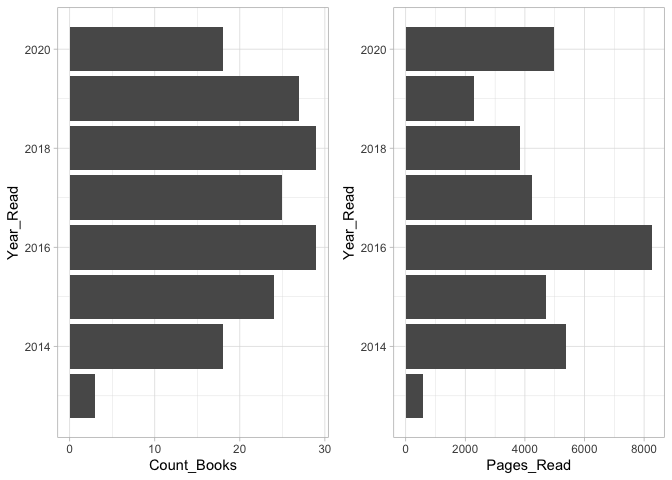
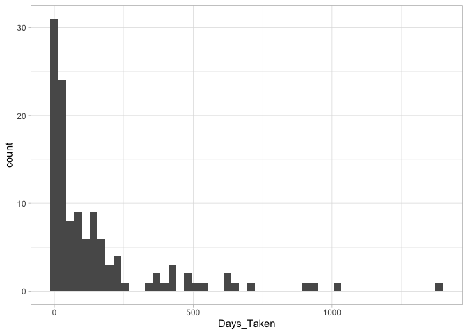
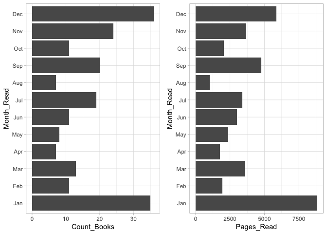
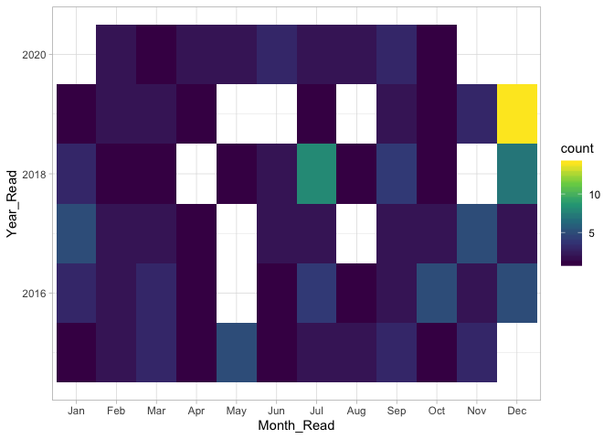
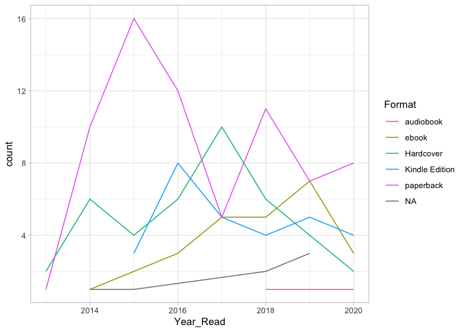
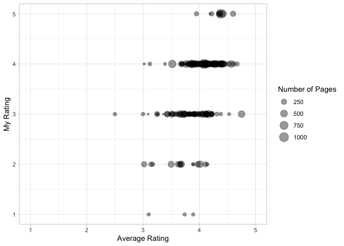
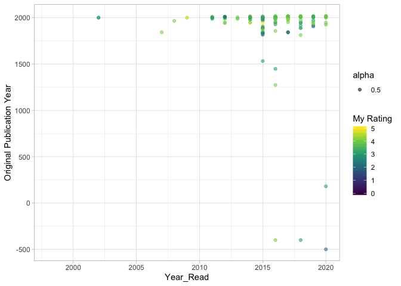

I started tracking my reading activity on the Goodreads app ~ 6 years ago. Why? Because Bertrand Russell once famously said, &gt;“There are two motives for reading a book; one, that you enjoy it; the other, that you can boast about it (on Goodreads).”

Okay, I'm joking about the second part! But I've actually found the Goodreads annual [Reading Challenges](https://www.goodreads.com/challenges/11621-2020-reading-challenge) to be a good motivation to read more books. It's a simple pledge you make to read a certain no. of books a year, but since it's tracked publicly on a social media site, you end up completing the challenge more often than not, out of vanity, if not, motivation.

In this post, I try to do a quick analysis of my Goodreads activity using the R programming language and the [tidyverse](https://www.tidyverse.org/) ecosystem of tools created by [Hadley Wickham](http://hadley.nz/). I've always found that the simplicity and expressiveness of `tidyverse` with the `magrittr` package for data wrangling and exploratory data analysis is unmatched in any other language or tool, functional programming at its best!

Loading necessary libraries
---------------------------

``` r
library(tidyverse)
library(magrittr)
library(lubridate)
theme_set(theme_light())
```

Importing data from Goodreads
-----------------------------

You can download the details of all your books added to Goodreads in a CSV format like [this](https://www.goodreads.com/review/import)

``` r
gr_books <- read_csv("goodreads_library_export.csv")
glimpse(gr_books)
```

    ## Observations: 364
    ## Variables: 31
    ## $ `Book Id`                    <int> 10534, 682772, 10673823, 703101, 17…
    ## $ Title                        <chr> "The Art of War", "Dilbert Gives Yo…
    ## $ Author                       <chr> "Sun Tzu", "Scott Adams", "Gayle La…
    ## $ `Author l-f`                 <chr> "Tzu, Sun", "Adams, Scott", "McDowe…
    ## $ `Additional Authors`         <chr> "Thomas Cleary, Pulat Otkan, Giray …
    ## $ ISBN                         <chr> "=\"1590302257\"", "=\"0740700030\"…
    ## $ ISBN13                       <chr> "=\"9781590302255\"", "=\"978074070…
    ## $ `My Rating`                  <int> 2, 0, 0, 0, 0, 2, 3, 0, 4, 0, 0, 0,…
    ## $ `Average Rating`             <dbl> 3.97, 3.95, 3.77, 4.25, 3.66, 3.50,…
    ## $ Publisher                    <chr> "Shambhala", "Andrews McMeel Publis…
    ## $ Binding                      <chr> "Paperback", "Paperback", "Hardcove…
    ## $ `Number of Pages`            <int> 273, 224, 280, 224, 450, 366, 208, …
    ## $ `Year Published`             <int> 2005, 1999, 2011, 1988, 2004, 2015,…
    ## $ `Original Publication Year`  <int> -500, 1999, 2011, 1988, 2004, NA, 2…
    ## $ `Date Read`                  <date> 2020-10-15, NA, NA, NA, NA, 2020-0…
    ## $ `Date Added`                 <date> 2020-08-07, 2020-10-13, 2020-08-08…
    ## $ Bookshelves                  <chr> NA, "currently-reading", "currently…
    ## $ `Bookshelves with positions` <chr> NA, "currently-reading (#11)", "cur…
    ## $ `Exclusive Shelf`            <chr> "read", "currently-reading", "curre…
    ## $ `My Review`                  <chr> "Quite a literal and dry collection…
    ## $ Spoiler                      <chr> NA, NA, NA, NA, NA, NA, NA, NA, NA,…
    ## $ `Private Notes`              <chr> NA, NA, NA, NA, NA, NA, NA, NA, NA,…
    ## $ `Read Count`                 <int> 1, 1, 1, 0, 0, 1, 1, 0, 1, 0, 0, 0,…
    ## $ `Recommended For`            <chr> NA, NA, NA, NA, NA, NA, NA, NA, NA,…
    ## $ `Recommended By`             <chr> NA, NA, NA, NA, NA, NA, NA, NA, NA,…
    ## $ `Owned Copies`               <int> 0, 0, 0, 0, 0, 0, 0, 0, 0, 0, 0, 0,…
    ## $ `Original Purchase Date`     <chr> NA, NA, NA, NA, NA, NA, NA, NA, NA,…
    ## $ `Original Purchase Location` <chr> NA, NA, NA, NA, NA, NA, NA, NA, NA,…
    ## $ Condition                    <chr> NA, NA, NA, NA, NA, NA, NA, NA, NA,…
    ## $ `Condition Description`      <chr> NA, NA, NA, NA, NA, NA, NA, NA, NA,…
    ## $ BCID                         <chr> NA, NA, NA, NA, NA, NA, NA, NA, NA,…

Selecting useful columns
------------------------

We end up getting a lot of useless / empty columns by default from the CSV. So let's just pick the most useful ones.

``` r
books <- gr_books %>%
  select(Title, Author, `My Rating`, `Average Rating`, Binding, 
         `Number of Pages`, `Year Published`, `Original Publication Year`, 
         `Date Read`, `Date Added`, `Exclusive Shelf`, `My Review`)

glimpse(books)
```

    ## Observations: 364
    ## Variables: 12
    ## $ Title                       <chr> "The Art of War", "Dilbert Gives You…
    ## $ Author                      <chr> "Sun Tzu", "Scott Adams", "Gayle Laa…
    ## $ `My Rating`                 <int> 2, 0, 0, 0, 0, 2, 3, 0, 4, 0, 0, 0, …
    ## $ `Average Rating`            <dbl> 3.97, 3.95, 3.77, 4.25, 3.66, 3.50, …
    ## $ Binding                     <chr> "Paperback", "Paperback", "Hardcover…
    ## $ `Number of Pages`           <int> 273, 224, 280, 224, 450, 366, 208, 1…
    ## $ `Year Published`            <int> 2005, 1999, 2011, 1988, 2004, 2015, …
    ## $ `Original Publication Year` <int> -500, 1999, 2011, 1988, 2004, NA, 20…
    ## $ `Date Read`                 <date> 2020-10-15, NA, NA, NA, NA, 2020-09…
    ## $ `Date Added`                <date> 2020-08-07, 2020-10-13, 2020-08-08,…
    ## $ `Exclusive Shelf`           <chr> "read", "currently-reading", "curren…
    ## $ `My Review`                 <chr> "Quite a literal and dry collection …

Extracting date information from Date Read & Date Added
-------------------------------------------------------

This information will useful in creating some plots later. Notice how the lubridate library makes it so easy to calculate the time interval between any 2 dates in \# of days.

``` r
books %<>%
  mutate(Year_Read = year(`Date Read`),
         Month_Read = month(`Date Read`, label = TRUE),
         Days_Taken = if_else(`Date Read` > `Date Added`,
                              interval(`Date Added`, `Date Read`) %/% days(1), 
                              NA_real_)
         )

glimpse(books)
```

    ## Observations: 364
    ## Variables: 15
    ## $ Title                       <chr> "The Art of War", "Dilbert Gives You…
    ## $ Author                      <chr> "Sun Tzu", "Scott Adams", "Gayle Laa…
    ## $ `My Rating`                 <int> 2, 0, 0, 0, 0, 2, 3, 0, 4, 0, 0, 0, …
    ## $ `Average Rating`            <dbl> 3.97, 3.95, 3.77, 4.25, 3.66, 3.50, …
    ## $ Binding                     <chr> "Paperback", "Paperback", "Hardcover…
    ## $ `Number of Pages`           <int> 273, 224, 280, 224, 450, 366, 208, 1…
    ## $ `Year Published`            <int> 2005, 1999, 2011, 1988, 2004, 2015, …
    ## $ `Original Publication Year` <int> -500, 1999, 2011, 1988, 2004, NA, 20…
    ## $ `Date Read`                 <date> 2020-10-15, NA, NA, NA, NA, 2020-09…
    ## $ `Date Added`                <date> 2020-08-07, 2020-10-13, 2020-08-08,…
    ## $ `Exclusive Shelf`           <chr> "read", "currently-reading", "curren…
    ## $ `My Review`                 <chr> "Quite a literal and dry collection …
    ## $ Year_Read                   <dbl> 2020, NA, NA, NA, NA, 2020, 2020, NA…
    ## $ Month_Read                  <ord> Oct, NA, NA, NA, NA, Sep, Sep, NA, S…
    ## $ Days_Taken                  <dbl> 69, NA, NA, NA, NA, 36, 40, NA, 25, …

Count of books by shelves
-------------------------

Just a spread of books across the 3 basic shelves provided by Goodreads

``` r
books %>%
  group_by(`Exclusive Shelf`) %>%
  summarise(count = n())
```

    ## # A tibble: 3 x 2
    ##   `Exclusive Shelf` count
    ##   <chr>             <int>
    ## 1 currently-reading    11
    ## 2 read                205
    ## 3 to-read             148

Year on year reading stats - Books vs Pages Read
------------------------------------------------

``` r
yearly_stats <- books %>%
  group_by(Year_Read) %>%
  summarise(Count_Books = n(),
            Pages_Read = sum(`Number of Pages`, na.rm = TRUE)) %>%
  filter(Year_Read > 2012) 

pages_plot <- yearly_stats %>%
  ggplot(aes(x=Year_Read)) +
  geom_col(aes(y=Pages_Read)) +
  coord_flip()

count_plot <- yearly_stats %>%
  ggplot(aes(x=Year_Read)) +
  geom_col(aes(y=Count_Books)) + 
  coord_flip()

library(cowplot) ## To print 2 plots side by side
plot_grid(count_plot, pages_plot)
```



While the no. of books I read in the last 5 years have stayed roughly the same, the no. of pages I read were the highest in 2016. Am I past my peak now :O

Distribution of the no of days taken
------------------------------------

We are looking at the length of time taken from adding the book on Goodreads to makring it as finished.

``` r
books %>%
  filter(!is.na(Days_Taken)) %>%
  ggplot(aes(Days_Taken)) +
  geom_histogram(bins=50)
```

 It seems most books are over within a year.

Checking months with maximum activity
-------------------------------------

``` r
count_month <- books %>%
  filter(!is.na(Month_Read)) %>% ## Remove books that aren't read yet
  group_by(Month_Read) %>%
  summarise(Count_Books = n()) %>%
  ungroup() %>%
  ggplot() +
  geom_col(aes(x = Month_Read, y = Count_Books, group = Month_Read)) +
  coord_flip()

pages_month <- books %>%
  filter(!is.na(Month_Read)) %>% ## Remove books that aren't read yet
  group_by(Month_Read) %>%
  summarise(Pages_Read = sum(`Number of Pages`, na.rm = TRUE)) %>%
  ungroup() %>%
  ggplot() +
  geom_col(aes(x = Month_Read, y = Pages_Read, group = Month_Read)) +
  coord_flip()

plot_grid(count_month, pages_month)
```

 Ha, that's the effect of the annual Reading Challenge on Goodreads. I read the most at the start of the year, with motivation to finish the new challenge, and then again, at the end of the year, out of the fear of the pending deadline!

But notice the pages read per month for the month of December. Even though the count of books in December is roughly the same as that of January, the count of pages read is substantially lower! This rightly illustrates that I end up reading much shorter books towards the end of the year in order to meet the goals. So I do end up sacrificing on my reading quality vs quantity for the challenge.

Checking monthly activity across the years
------------------------------------------

``` r
books %>%
  filter(!is.na(Month_Read)) %>% ## Remove books that aren't read yet
  filter(Year_Read > 2014) %>%
  group_by(Year_Read, Month_Read) %>%
  summarise(count = n()) %>%
  ungroup() %>%
  ggplot() +
  geom_tile(aes(x = Month_Read, y = Year_Read, fill = count)) +
  scale_fill_viridis_c()
```

 I really slacked out last year it seems, with some months of no activity and then a sudden burst of activity at the end of the year to meet the challenge.

Format of books acros the years
-------------------------------

Let's the look at the format of the books I read in the last few years, ie, e-book, audiobook, paperback, etc.

``` r
books %<>%
  mutate(Format = case_when(
    Binding %in% c("Audible Audio", "Audiobook") ~ "audiobook", 
    Binding %in% c("ebook", "Part-In-Omnibus") ~ "ebook",
    Binding %in% c("Mass Market Paperback", "Paperback", "issue") ~ "paperback",
    TRUE ~ Binding
  ))

books %>%
  filter(!is.na(Year_Read)) %>% ## Remove books that aren't read yet
  filter(Year_Read > 2012) %>%
  group_by(Year_Read, Format) %>%
  summarise(count = n()) %>%
  ungroup() %>%
  ggplot() +
  geom_line(aes(x = Year_Read, y = count, group = Format, colour = Format))
```

 There is no clear trend here, however, paperback tends to dominate. I have been using the [Audible](https://www.audible.com/) app from Amazon to recently as well and I found it to be really great!

Let's look at the ratings
-------------------------

I'm comparing my rating with the average rating of the book on Goodreads site. I've also tried to visualize the length of the book as the size of the bubbles in the scatter plot to see if it has any meaningful relation with ratings.

``` r
books %>%
  filter(`Exclusive Shelf` == "read") %>%
  ggplot() +
  geom_point(aes(x=`Average Rating`, y=`My Rating`,
                 size = `Number of Pages`), alpha = 0.4) +
  xlim(1, 5) +
  ylim(1, 5)
```

 So I ended up picking books with an average rating in the range of 2.5 to 4.5. Most of the books I rated low (1 or 2) do seem to be the smaller in size comparitively. Again, these could be some of the quick reads I picked up just to meet the annual goals.

Original Publication Year vs Date Read & My Rating
--------------------------------------------------

For most classics, Goodreads shows the original publication year as well.

``` r
books %>%
  ggplot() +
  geom_point(aes(x=Year_Read, y=`Original Publication Year`, 
                 colour = `My Rating`, alpha = 0.5)) +
  scale_color_viridis_c()
```



So I have read a few classical books lately, dating back to 500 BC. I've also added my rating for the book as a color to the scatter plot.
